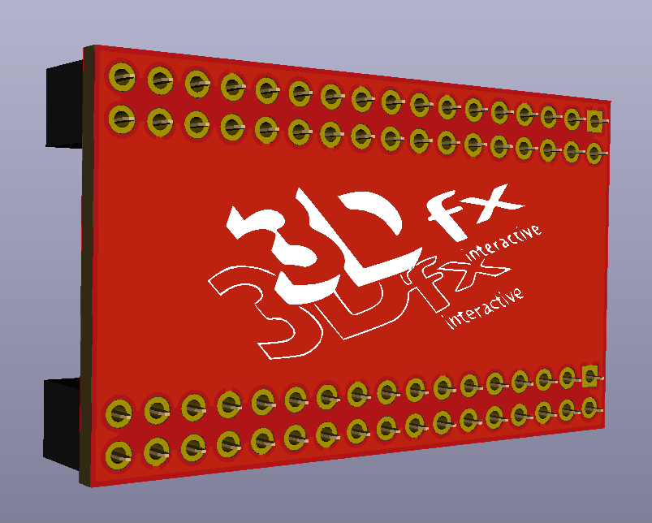

# 3DFX SLI Bridge
A clean SLI bridge for the Voodoo 2 SLI (single slot spacing). 

## Info
Designed with 4 layers to hide the traces on the inside, so you get a clean look for the logo. I did the best I could with this 3-dimensional 3DFX logo converted to silkscreen. Build using (2) 2x17 2.54mm pitch female pin sockets.
\
\
Tested and working.
